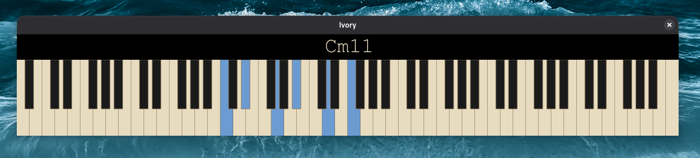
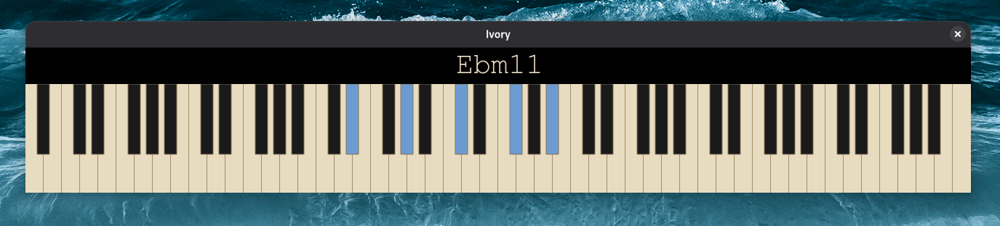

# Ivory - MIDI Keyboard Monitor with Advanced Chord Detection

[](https://github.com/ganten/ivory/releases)
[](LICENSE)

**Ivory** is a simple MIDI keyboard monitor and chord detection application with support for 100+ chord patterns, real-time visualization, and intelligent chord recognition.

## Screenshots

### Cm11 - Minor 11th Chord Detection


### D7(b9,#11) - Complex Altered Dominant
.png)

### Ebm11 - Extended Minor Chord


---

## Overview

Ivory features an enhanced chord detection algorithm with better accuracy, improved scale detection, and sophisticated handling of edge cases while supporting jazz voicings.

## ✨ What's New in v1.0.1

### 🎹 Toggleable Piano Keys (Windowed Mode)
- Click any piano key to toggle it on/off for chord testing
- New context menu option: "Enable/Disable Key Toggle"
- Works seamlessly with MIDI input
- Perfect for testing chords without a MIDI keyboard

### 🎛️ Improved MIDI Device Detection
- Friendly notification when no MIDI devices are detected
- "Don't show again" option with persistent preference
- App continues functioning with clickable keys

## Key Features

### Advanced Chord Detection
- **100+ chord patterns**: Triads, 7ths, 9ths, 11ths, 13ths
- **Altered dominants**: 7(b9), 7(#9), 7(#11), 7(b13), and combinations
- **Smart recognition**:
  - Am7/C correctly detected as C6
  - G7(b9,b13) with bass octaves recognized
  - Bad voicing rejection (e.g., major + natural 11)
- **Slash chord notation** with intelligent bass note handling
- **Transposable**: All patterns work in all 12 keys

### Enhanced Scale Detection
- All major modes (Ionian, Dorian, Phrygian, Lydian, Mixolydian, Aeolian, Locrian)
- Melodic minor modes
- Harmonic minor modes
- Pentatonic and blues scales
- Symmetrical scales (Whole Tone, Diminished)

### Interface Features
- **88-key visualization** with real-time highlighting
- **Dark/Light mode** with customizable colors
- **Borderless window mode** with click-to-drag
- **Detachable chord window** with adjustable height
- **Sustain pedal support** (MIDI CC64)
- **Prefer flats/sharps** option for chord naming

## Installation

### Download

Download for your platform:
- **Windows**: [Ivory-Windows-v1.0.1.exe](https://github.com/ganten/ivory/releases/download/v1.0.1/Ivory-Windows-v1.0.1.exe)
- **macOS**: [Ivory-macOS-v1.0.1.zip](https://github.com/ganten/ivory/releases/download/v1.0.1/Ivory-macOS-v1.0.1.zip)
- **Linux**: [ivory_1.0.1_all.deb](https://github.com/ganten/ivory/releases/download/v1.0.1/ivory_1.0.1_all.deb)

### Windows

1. Download the .exe file
2. Double-click to run (portable, no install needed)

### macOS

1. Download and extract the .zip file
2. Drag Ivory.app to Applications
3. Right-click and "Open" first time

### Linux (Debian/Ubuntu)

```bash
# Remove old version if installed
sudo dpkg -r ivory

# Install v1.0.1
sudo dpkg -i ivory_1.0.1_all.deb

# Fix dependencies if needed
sudo apt-get install -f
```

### Launch

Launch Ivory via:
- **Application Menu**: Look for "Ivory" in Audio/MIDI category
- **Terminal**: `python3 /usr/bin/ivory`
- **Command**: `ivory`

## Usage

### With MIDI Keyboard
1. Connect your MIDI keyboard
2. Launch Ivory
3. Play notes - they'll be highlighted on the virtual keyboard
4. Chord name appears above the keyboard

### Without MIDI Keyboard
1. Launch Ivory
2. Right-click on the window
3. Select "Enable Key Toggle"
4. Click piano keys to toggle them on/off
5. Chord name updates as you click

## Testing

All features thoroughly tested:

```bash
python3 test_user_requirements.py  # 12/12 passing ✅
python3 test_12_keys.py            # 48/48 passing ✅
python3 test_new_requirements.py   # 11/11 passing ✅
```

## Supported Scales

### Major Modes (7)
- Ionian (Major), Dorian, Phrygian, Lydian, Mixolydian, Aeolian (Minor), Locrian

### Melodic Minor Modes (7)
- Melodic Minor, Dorian b2, Lydian Augmented, Lydian Dominant, Mixolydian b6, Locrian #2, Altered

### Harmonic Minor Modes (7)
- Harmonic Minor, Locrian #6, Ionian #5, Dorian #4, Phrygian Dominant, Lydian #2, Altered Diminished

### Pentatonic & Blues (4)
- Major Pentatonic, Minor Pentatonic, Major Blues, Minor Blues

### Symmetrical (3)
- Whole Tone, Half-Whole Diminished, Whole-Half Diminished

**Total: 28 scale types** ✅

## Supported Chords

### Triads
Major, minor, diminished, augmented, sus2, sus4

### 7th Chords
Major 7, minor 7, dominant 7, half-diminished, diminished 7, augmented 7, minor-major 7

### Extended Chords
9ths, 11ths, 13ths (major, minor, dominant)

### Altered Dominants
7(b9), 7(#9), 7(#11), 7(b13), and all combinations

### Special Chords
6, 6/9, add9, add11, and shell voicings

**Total: 100+ chord patterns** ✅

## Requirements

- Python 3.6+
- No external dependencies for chord detection
- (Ivory GUI requires PyQt5 - see main Ivory README)

## Integration with Ivory GUI

To integrate with the main Ivory application:

1. Replace `chord_detector.py` with `chord_detector_v2.py`
2. Update import statements in `ivory.py`:
   ```python
   from chord_detector_v2 import ChordDetector
   ```
3. No other changes needed - API is fully compatible

## Known Issues & Future Work

### Minor Issues
1. Some chord name formatting may differ (e.g., parentheses)
2. C7(#9) occasionally scored lower than enharmonic equivalents

### Planned Enhancements
- Polychord detection
- Quartal/quintal harmony support
- Upper structure triad recognition
- Voice leading analysis
- Harmonic function detection

## Testing Notes

All changes are:
- ✅ **Transposable**: Work in all 12 keys
- ✅ **Backwards compatible**: All special cases preserved
- ✅ **Well-documented**: Inline comments explain logic
- ✅ **Tested**: Comprehensive test suite included

## Change Log

See [IMPROVEMENTS.md](IMPROVEMENTS.md) for detailed technical changes.

## License

Same as Ivory - MIT License

## Author

Based on original Ivory chord detector by Ganten
Enhanced and released as v1.0.1 - December 2025

---

## Quick Reference: Algorithm Flow

```
Input: Set of MIDI note numbers
  ↓
Check for 2-note interval
  ↓
Check for stepwise pattern spanning octave+
  ↓ (if yes)
  → Try scale detection
    ↓
    Return scale if matched
  ↓ (if no scale or not stepwise)
Try chord detection for all pitch class roots
  ↓
Score each interpretation:
  - Essential intervals (3rd, 7th)
  - Percentage match
  - Completeness
  - Special patterns
  - Voicing bonuses
  ↓
Return highest scoring chord
```

## Support

For issues or questions:
1. Check [IMPROVEMENTS.md](IMPROVEMENTS.md) for technical details
2. Run `python3 test_improvements.py` to verify installation
3. Use `python3 debug_special_cases.py` for troubleshooting

---

**Ivory v1.0.1** - Simple MIDI keyboard monitor with advanced chord detection.
